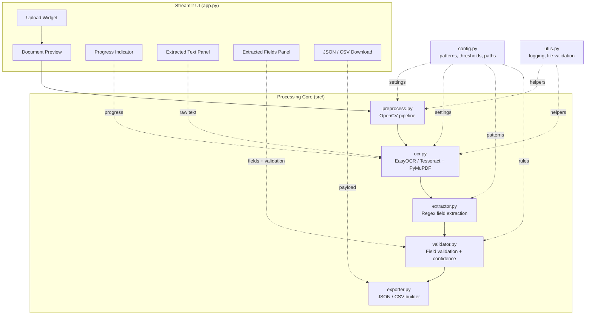
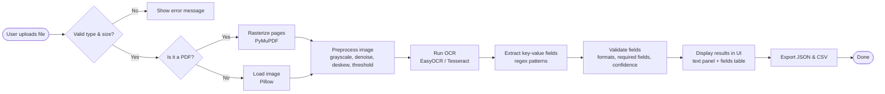

# 📄 AI Document Processor

An AI-powered **Intelligent Document Processing (IDP)** application that lets
users upload PDF or image documents, automatically extracts text using OCR,
identifies key business fields (invoice number, dates, totals, contact
details, etc.), validates them, and exports the structured results as JSON
or CSV — all through a clean Streamlit interface.

This is an original, from-scratch portfolio project built to demonstrate
practical understanding of IDP concepts (OCR, image preprocessing,
information extraction, data validation, and structured export). It does
not contain any proprietary code, data, or branding from any employer.

---

## Table of Contents

- [Project Overview](#project-overview)
- [Problem Statement](#problem-statement)
- [Features](#features)
- [System Architecture](#system-architecture)
- [Processing Workflow](#processing-workflow)
- [Technologies Used](#technologies-used)
- [Folder Structure](#folder-structure)
- [Installation](#installation)
- [Usage](#usage)
- [Sample Input](#sample-input)
- [Sample Output](#sample-output)
- [Testing](#testing)
- [Future Improvements](#future-improvements)
- [Author](#author)
- [License](#license)

---

## Project Overview

Organizations process large volumes of unstructured documents — invoices,
receipts, forms — every day. Manually re-keying this data is slow and
error-prone. **AI Document Processor** demonstrates an end-to-end pipeline
that turns a scanned/photographed document into structured, validated,
machine-readable data with minimal manual effort.

## Problem Statement

Given an arbitrary invoice-like document (PDF, JPG, or PNG), automatically:

1. Clean up the image (remove noise, correct skew, improve contrast) so OCR performs well on imperfect scans/photos.
2. Extract raw text via OCR.
3. Identify structured key-value fields (invoice number, dates, amounts, contact info) from that raw text.
4. Validate the extracted values (correct formats, required fields present).
5. Surface a confidence score per field so low-quality extractions can be flagged for human review.
6. Export the final structured result as JSON and CSV for downstream use.

## Features

- 📤 Upload PDF, JPG, or PNG documents
- 🖼️ Multi-page PDF support with page-by-page preview
- 🧹 Image preprocessing: grayscale, denoising, adaptive thresholding, deskewing, auto-resize
- 🔍 Automatic OCR via **EasyOCR** (default) or **Tesseract**
- 🧾 Invoice/document key-value field extraction (invoice number, dates, totals, tax, vendor, customer, email, phone)
- ✅ Field-level validation (date formats, numeric amounts, email format)
- 📊 Per-field and overall **confidence scores**
- ⬇️ One-click **JSON** and **CSV** export
- ⚠️ Graceful error handling for unsupported files, oversized uploads, and OCR failures
- 🎛️ Clean, configurable Streamlit interface with live OCR progress

## System Architecture



## Processing Workflow



## Technologies Used

| Category   | Technology |
|------------|------------|
| Frontend   | [Streamlit](https://streamlit.io/) |
| Backend    | Python 3.10+ |
| OCR        | [EasyOCR](https://github.com/JaidedAI/EasyOCR) (default), [pytesseract](https://github.com/madmaz/pytesseract) (alternative) |
| Image processing | [OpenCV](https://opencv.org/), [Pillow](https://python-pillow.org/) |
| PDF rasterization | [PyMuPDF](https://pymupdf.readthedocs.io/) |
| Data handling | [Pandas](https://pandas.pydata.org/), [NumPy](https://numpy.org/) |
| Field extraction | Python `re` (regex) |
| Export | JSON, CSV |

## Folder Structure

```
AI-Document-Processor/
│
├── app.py                  # Streamlit entry point / UI
├── config.py                # Central configuration (paths, patterns, thresholds)
├── requirements.txt
├── README.md
├── LICENSE
├── .gitignore
│
├── src/
│   ├── preprocess.py         # Image preprocessing (OpenCV)
│   ├── ocr.py                 # OCR engines + PDF rasterization
│   ├── extractor.py           # Regex-based key-value extraction
│   ├── validator.py           # Field validation & confidence scoring
│   ├── exporter.py            # JSON / CSV export
│   └── utils.py                # Logging, file validation helpers
│
├── tests/                   # Unit tests (pytest)
├── assets/                  # README/banner images
├── sample_documents/        # Sample invoices/receipts for local testing
├── outputs/                  # Generated JSON/CSV exports (gitignored)
└── models/                   # EasyOCR model weight cache (gitignored)
```

## Installation

```bash
# 1. Clone the repository
git clone https://github.com/arun-abishek-n/AI-Document-Processor.git
cd AI-Document-Processor

# 2. Create and activate a virtual environment
python -m venv venv
venv\Scripts\activate        # Windows
source venv/bin/activate      # macOS / Linux

# 3. Install dependencies
pip install -r requirements.txt
```

> **Using Tesseract instead of EasyOCR?** Install the Tesseract binary
> separately ([installation guide](https://github.com/tesseract-ocr/tesseract#installing-tesseract)),
> then set `OCR_ENGINE = "tesseract"` in `config.py` (or the `OCR_ENGINE`
> environment variable), and set `TESSERACT_CMD` if it isn't on your PATH.

## Usage

```bash
streamlit run app.py
```

Then, in the browser tab that opens:

1. Upload a PDF, JPG, or PNG invoice/document.
2. Review the auto-generated page preview.
3. Watch the OCR progress indicator as the pipeline runs.
4. Inspect the raw extracted text and the structured fields table, including per-field confidence and validation status.
5. Download the results as **JSON** or **CSV**.

## Sample Input

Place a sample invoice/receipt (PDF, JPG, or PNG) in `sample_documents/` —
see [`sample_documents/README.md`](sample_documents/README.md) for
suggestions. A typical input looks like:

```
INVOICE

Invoice Number: INV-2024-0587
Invoice Date: 15/03/2024
Due Date: 30/03/2024

Bill From: Acme Supplies Co.
Bill To: Northwind Traders

Subtotal: 1200.00
Tax: 216.00
Total Amount: $1416.00

Contact: jane.doe@acmesupplies.com
Phone: +1 555 123 4567
```

## Sample Output

```json
{
  "source_file": "sample_invoice_01.pdf",
  "is_valid_document": true,
  "overall_confidence": 0.93,
  "missing_required_fields": [],
  "invalid_fields": [],
  "low_confidence_fields": [],
  "fields": {
    "invoice_number": {
      "value": "INV-2024-0587",
      "confidence": 0.96,
      "is_present": true,
      "is_valid": true,
      "issue": null
    },
    "invoice_date": {
      "value": "15/03/2024",
      "confidence": 0.94,
      "is_present": true,
      "is_valid": true,
      "issue": null
    },
    "total_amount": {
      "value": "1416.00",
      "confidence": 0.91,
      "is_present": true,
      "is_valid": true,
      "issue": null
    }
  }
}
```

The equivalent CSV export (`outputs/<name>.csv`) has one row per field:

```csv
field,value,confidence,is_present,is_valid,issue
invoice_number,INV-2024-0587,0.96,True,True,
invoice_date,15/03/2024,0.94,True,True,
total_amount,1416.00,0.91,True,True,
```

## Testing

Unit tests cover the pure-logic modules (field extraction and validation)
using synthetic OCR results, so they run without needing an OCR engine
installed:

```bash
pip install pytest
pytest tests/ -v
```

## Future Improvements

- Replace regex-based extraction with a fine-tuned NER / transformer model for higher accuracy on unstructured layouts
- Add table detection for line-item extraction (quantities, unit prices)
- Support batch processing of multiple documents in one session
- Add a human-in-the-loop correction UI that feeds back into validation rules
- Persist processed documents and results to a lightweight database for history/search
- Add multi-language OCR support beyond English

## Author

**Arun Abishek**
GitHub: [@arun-abishek-n](https://github.com/arun-abishek-n)

## License

This project is licensed under the [MIT License](LICENSE).
