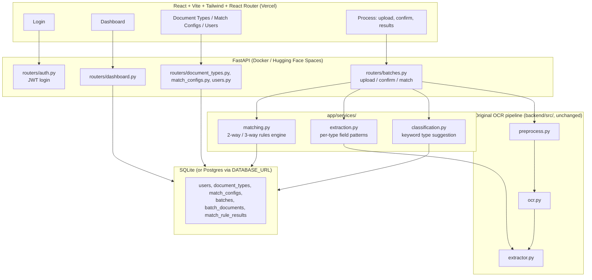
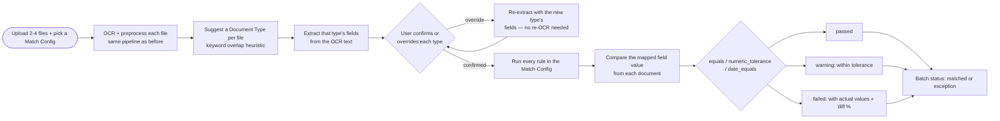

# AI Smart Document Processing

**AI-powered document intelligence: OCR extraction, configurable document
types, and real 2-way / 3-way document matching — with an authenticated,
role-based React dashboard on top of a FastAPI backend.**

## Overview

Finance and ops teams reconcile documents by hand every day: does this
invoice's total actually match the purchase order? Did the goods receipt
confirm what was ordered? This project automates that — upload a batch of
related documents (a purchase order, a goods receipt, an invoice), and the
system extracts structured fields from each via OCR, lets you confirm each
document's type, then runs a configurable rules engine that compares fields
across the documents and reports **passed / warning / failed** per rule,
with the actual values and the actual percentage difference — not a
hardcoded "✓ Matched".

This started as a single-document OCR extraction tool and was rebuilt into
this larger workflow; see [Future Improvements](#future-improvements) for
what's intentionally out of scope. It's an original, from-scratch portfolio
project — no proprietary code, data, or branding from any employer. UI
layout/spacing conventions (sidebar nav, KPI cards, config screens) were
inspired by common enterprise SaaS dashboard patterns; all copy, branding,
data, and code are original to this project.

## Live Demo

**Live Demo:** _[DEPLOYED_URL — add after deploying, see [Deployment](#deployment)]_

**Repository:** [github.com/arun-abishek-n/AI-Document-Processor](https://github.com/arun-abishek-n/AI-Document-Processor)

**Demo accounts** (also shown on the login page):

| Role      | Username    | Password       | Can access                                                  |
| --------- | ----------- | -------------- | -------------------------------------------------------------- |
| Admin     | `admin`     | `admin123`     | Everything, including Users management                          |
| Manager   | `manager`   | `manager123`   | Dashboard, Document Types, Match Configs, Process               |
| Executive | `executive` | `executive123` | Dashboard, Process (upload, confirm, view results)               |

These are intentionally public demo credentials for a portfolio project, not real secrets.

## Features

- 🔐 JWT-based login with three roles (Admin / Manager / Executive) — navigation and API access are both actually gated by role, not just hidden in the UI
- 📄 Configurable **Document Types** (Invoice, Purchase Order, Goods Receipt, Delivery Note by default) — each with its own extraction fields, editable in the UI
- 🔗 Configurable **Match Configurations** — named 2-way or 3-way rule bundles, each comparing specific fields across specific document types
- 📤 Batch upload (drag-and-drop or browse) with automatic **keyword-based type suggestion** per file, which you confirm or override before matching runs
- 🔍 OCR via **EasyOCR** (default, no external binary) or **Tesseract**, with OpenCV preprocessing (denoise, deskew, adaptive threshold) for imperfect scans/photos
- ⚖️ A real matching engine: **equals**, **numeric-tolerance** (%), and **date-equals** comparisons, each producing passed/warning/failed with the actual compared values
- 📊 A dashboard with real KPIs (processed count, match rate, open exceptions, average confidence, in-flight count) and charts — computed from actual batch history, with proper empty states when there's none yet
- 👥 **Users** management (Admin only)
- ⚠️ Meaningful error messages throughout — unsupported files, oversized uploads, corrupted documents, backend/network failures — never a silent failure or a generic crash

## Architecture



## How It Works



1. **Upload** — 2-4 files, plus which Match Configuration to run.
2. **OCR** — each file goes through the same preprocessing + OCR as the original single-document pipeline (`backend/src/`), unchanged.
3. **Suggest a type** — a keyword/heuristic scan of the OCR text and filename against each configured Document Type's name/description/field labels picks the best guess. This is explicitly heuristic, not a trained classifier.
4. **Confirm or override** — the user reviews the suggestion per file; overriding re-runs field extraction against the new type's fields from the already-OCR'd text (no re-scan needed).
5. **Extract fields** — each Document Type's fields get a regex pattern (custom, or auto-generated from the field's key/label shape — see [Document Processing Pipeline](#document-processing-pipeline)), run through the same extractor used by the original pipeline.
6. **Match** — every rule in the selected Match Configuration pulls its mapped field from each document and compares them (see [2-Way Matching](#2-way-matching) / [3-Way Matching](#3-way-matching)).
7. **Result** — the batch is `matched` (every rule passed or warned) or `exception` (at least one rule failed), and the Results page shows every rule's actual compared values.

## Document Processing Pipeline

Unchanged from the original single-document tool, reused as-is for every file in a batch:

**Preprocess** (`backend/src/preprocess.py`, OpenCV) → **OCR** (`backend/src/ocr.py`, EasyOCR/Tesseract + PyMuPDF for PDFs) → **Extract** (`backend/src/extractor.py`, regex against a `{field_key: pattern}` map).

What's new is *where that pattern map comes from*: instead of one fixed schema, `backend/app/services/extraction.py` builds it per Document Type — a custom regex if the admin set one on that field, otherwise a pattern generated from the field's key/label shape (`*_number` expects a "No./Number/#" qualifier, `*_date` expects a date after a "Date" qualifier, `*_name` expects a "Name" qualifier, amount/quantity/email/phone/GSTIN keys get their own shapes, anything else falls back to a generic "label: value" pattern).

## 2-Way Matching

Compares fields across exactly **2** document types (e.g. Purchase Order ↔ Invoice). Each rule specifies, per document type, which field to read, and a comparison mode:

- **equals** — normalized (trimmed, case-insensitive) string equality. Used for PO numbers, vendor/supplier names.
- **numeric_tolerance** — parses both values as numbers; exact match passes, a difference within the rule's tolerance % is a **warning**, beyond it is a **failure**. Used for totals.
- **date_equals** — parses both values against the same date formats `src/validator.py` already supports, compares the parsed dates.

## 3-Way Matching

The same engine, extended to **3** document types (e.g. Purchase Order ↔ Goods Receipt ↔ Invoice) — a rule's field map just has three entries instead of two, and every value must agree (or fall within tolerance) for the rule to pass. This is the classic 3-way match used in accounts-payable workflows: does what was ordered match what was received match what was billed?

A **warning** on any rule doesn't fail the batch (mirroring how the original single-document validator treats low OCR confidence as a review flag, not a hard error) — only a **failed** rule does.

## Tech Stack

| Category          | Technology                                                                 |
| ------------------ | --------------------------------------------------------------------------- |
| Frontend           | [React](https://react.dev/), [TypeScript](https://www.typescriptlang.org/), [Vite](https://vite.dev/), [Tailwind CSS](https://tailwindcss.com/), [React Router](https://reactrouter.com/), [Recharts](https://recharts.org/) |
| Backend            | [FastAPI](https://fastapi.tiangolo.com/), Python 3.11+                     |
| Auth               | JWT ([PyJWT](https://pyjwt.readthedocs.io/)), [bcrypt](https://pypi.org/project/bcrypt/) password hashing |
| Database           | [SQLAlchemy](https://www.sqlalchemy.org/) + SQLite (swappable for Postgres via `DATABASE_URL`) |
| OCR                | [EasyOCR](https://github.com/JaidedAI/EasyOCR) (default), [pytesseract](https://github.com/madmaz/pytesseract) (alternative) |
| Image processing   | [OpenCV](https://opencv.org/), [Pillow](https://python-pillow.org/)         |
| PDF rasterization  | [PyMuPDF](https://pymupdf.readthedocs.io/)                                  |
| Field extraction   | Python `re` (regex, per-document-type pattern generation)                   |
| Testing            | [pytest](https://pytest.org/), FastAPI `TestClient`                         |
| Deployment         | [Vercel](https://vercel.com/) (frontend), [Hugging Face Spaces](https://huggingface.co/spaces) / Docker (backend) |

No paid third-party AI API is used anywhere — OCR runs locally via EasyOCR/Tesseract, and matching/classification are deterministic rules and regex, not an LLM call.

## Project Structure

```
AI-Document-Processor/
│
├── frontend/
│   ├── src/
│   │   ├── pages/            # Login, Dashboard, DocumentTypes, MatchConfigs, Users, Process, BatchDetail
│   │   ├── layouts/           # AppLayout (sidebar + role-filtered nav)
│   │   ├── context/           # AuthContext
│   │   ├── components/        # BatchUploadCard, FieldsTable, TextPanel, JsonPanel, Modal, ProtectedRoute, ...
│   │   └── lib/                # api.ts (backend client), export.ts (JSON download)
│   └── .env.example
│
├── backend/
│   ├── app/
│   │   ├── routers/           # auth, documents, document_types, match_configs, users, batches, dashboard
│   │   ├── services/          # classification.py, extraction.py, matching.py
│   │   ├── models.py          # SQLAlchemy: User, DocumentType, MatchConfig, Batch, ...
│   │   ├── database.py, seed.py, auth.py, pipeline.py, schemas*.py
│   ├── src/                  # Original OCR pipeline (unchanged)
│   │   ├── preprocess.py, ocr.py, extractor.py, validator.py, exporter.py, utils.py
│   ├── tests/                 # pytest suite (unit + API + one real-OCR integration test)
│   ├── config.py, requirements.txt, requirements-dev.txt, Dockerfile
│
├── .gitignore
├── README.md
└── LICENSE
```

## Installation

### Backend

```bash
cd backend
python -m venv venv
venv\Scripts\activate        # Windows
source venv/bin/activate      # macOS / Linux

pip install -r requirements.txt
cp .env.example .env          # optional — defaults work out of the box
uvicorn app.main:app --reload
```

The API is now at `http://localhost:8000` (interactive docs at `/docs`). On first run it creates `backend/data/app.db` (SQLite) and seeds the demo users, document types, and match configs automatically.

> **Using Tesseract instead of EasyOCR?** Install the Tesseract binary
> separately ([installation guide](https://github.com/tesseract-ocr/tesseract#installing-tesseract)),
> then set `OCR_ENGINE=tesseract`, and set `TESSERACT_CMD` if it isn't
> already on your PATH.

### Frontend

```bash
cd frontend
npm install
cp .env.example .env    # VITE_API_URL=http://localhost:8000
npm run dev
```

## Running Locally

1. Start the backend, then the frontend (above).
2. Open `http://localhost:5173`, log in with any demo account.
3. **Admin/Manager**: check Document Types and Match Configs — the defaults (Invoice, Purchase Order, Goods Receipt, Delivery Note; a 2-way PO↔Invoice and a 3-way PO↔GRN↔Invoice config) are ready to use as-is.
4. Go to **Process**, pick a Match Configuration, upload the matching number of documents (2 for a 2-way config, 3 for 3-way), confirm the suggested type per file, and run matching.
5. View the result — passed/warning/failed per rule with actual values, plus each document's extracted fields, raw text, and JSON.

## Environment Variables

**Backend** (`backend/.env`, see `backend/.env.example`):

| Variable          | Default                       | Purpose                                                        |
| ------------------ | ------------------------------ | ---------------------------------------------------------------- |
| `ALLOWED_ORIGINS`  | `http://localhost:5173`       | Comma-separated frontend origins allowed by CORS                |
| `JWT_SECRET`       | _(insecure dev default)_      | **Must** be overridden in production — signs login session tokens |
| `DATABASE_URL`     | `sqlite:///./data/app.db`     | Swap for a Postgres URL for persistence across restarts          |
| `OCR_ENGINE`       | `easyocr`                     | `easyocr` or `tesseract`                                        |
| `TESSERACT_CMD`    | _(unset)_                     | Path to the Tesseract binary, if not on PATH                     |
| `LOG_LEVEL`        | `INFO`                        | Python logging level                                             |

**Frontend** (`frontend/.env`, see `frontend/.env.example`):

| Variable        | Default                   | Purpose                                   |
| ---------------- | -------------------------- | -------------------------------------------- |
| `VITE_API_URL`   | `http://localhost:8000`   | Base URL of the deployed backend API      |

## API Endpoints

| Method | Path                                     | Auth               | Purpose                                        |
| ------ | ------------------------------------------ | -------------------- | ------------------------------------------------- |
| GET    | `/api/health`                             | none                | Liveness + config check                          |
| POST   | `/api/process`                            | none                | Standalone single-document OCR extraction (original endpoint, still works) |
| POST   | `/api/auth/login`                         | none                | Returns a JWT + user info                         |
| GET    | `/api/auth/me`                            | any                 | Current user                                      |
| GET/POST/PUT/DELETE | `/api/document-types`, `/api/document-types/{id}` | read: any, write: admin/manager | Document type + field CRUD |
| GET/POST/PUT/DELETE | `/api/match-configs`, `/api/match-configs/{id}`  | read: any, write: admin/manager | Match configuration + rule CRUD |
| GET/POST/PATCH | `/api/users`, `/api/users/{id}`      | admin               | User management                                    |
| POST   | `/api/batches`                            | any                 | Upload a batch (multipart `files[]` + `match_config_id`) — OCR + type suggestion + extraction |
| PATCH  | `/api/batches/{id}/documents/{doc_id}`    | any                 | Confirm/override a document's type (re-extracts, no re-OCR) |
| POST   | `/api/batches/{id}/match`                 | any                 | Run the matching engine, finalize batch status     |
| GET    | `/api/batches`, `/api/batches/{id}`       | any                 | Batch list / detail                               |
| GET    | `/api/dashboard/summary`                  | any                 | Real KPI aggregates                                |

Every write endpoint enforces its role server-side (not just hidden in the UI) via a FastAPI dependency (`app/auth.py::require_role`). Full interactive docs at `/docs`.

## Testing

```bash
cd backend
pip install -r requirements-dev.txt
pytest                 # 50 fast tests: auth, RBAC, CRUD, matching engine, extraction, API error handling
pytest -m integration  # + 2 real end-to-end OCR tests (one single-document, one full batch classify+match)
```

The matching-engine and extraction-pattern-generator tests are pure unit tests (no OCR, no HTTP) — several were written *after* finding real bugs while manually testing the feature end-to-end (a greedy name-field regex that swallowed the next OCR line, a missing mandatory qualifier that caused false-positive number matches, a batch's processing time never being recorded). Each has a regression test.

Manually verified in a real browser (Playwright-driven, screenshotted, checked for console errors) for both Admin and Executive roles:

| # | Scenario                                              | Result                                                        |
| - | -------------------------------------------------------- | ---------------------------------------------------------------- |
| 1 | Log in, role-appropriate nav renders                   | Admin sees all 5 sections; Executive sees only Dashboard + Process |
| 2 | Force-navigate to an unauthorized route (e.g. `/users` as Executive) | Redirected to Dashboard, not shown the page                    |
| 3 | Upload a real 3-way batch with genuinely matching documents | Every rule passes; batch status `matched`                       |
| 4 | Upload a real 2-way batch with a genuinely mismatched total | Total Amount rule fails with the actual % difference; batch status `exception` |
| 5 | Create/edit/delete a Document Type and a Match Configuration | Persists and reflects immediately in Process's dropdown          |
| 6 | Backend unreachable                                     | Frontend shows a clear connection error, not a hang               |

## Deployment

Architecture: **React frontend on Vercel** talking over HTTPS to a **FastAPI backend (with SQLite) in a Docker container on Hugging Face Spaces**.

EasyOCR pulls in PyTorch and needs meaningfully more memory than most free web-service tiers provide (Render/Railway/Fly's free tiers cap around 256–512 MB, risking an out-of-memory crash). Hugging Face Spaces' free Docker tier provides 16 GB RAM, comfortably covering this pipeline plus SQLite at zero cost.

**Known limitation:** Hugging Face Spaces' free tier doesn't persist a container's filesystem across a cold restart (it sleeps after inactivity). `backend/app/seed.py` re-seeds the demo users/document types/match configs automatically if the database is empty, so the app is always immediately usable — but any batches you processed before a restart won't still be there. For true cross-restart persistence, set `DATABASE_URL` to a free hosted Postgres instance (e.g. [Neon](https://neon.tech) or [Supabase](https://supabase.com)) instead.

### Backend → Hugging Face Spaces

1. Create a new [Space](https://huggingface.co/new-space) with the **Docker** SDK.
2. Clone the Space's own git repo it gives you, then copy this repo's `backend/` contents into it (everything except `venv/`, `outputs/`, `models/`, `logs/`, `data/` — see `backend/.dockerignore`):
   ```bash
   git clone https://huggingface.co/spaces/<your-username>/<space-name>
   cp -r backend/* backend/.dockerignore backend/.gitignore <space-name>/
   cd <space-name>
   git add . && git commit -m "Deploy backend" && git push
   ```
3. In the Space's **Settings → Variables and secrets**, add:
   - `ALLOWED_ORIGINS` = your Vercel frontend's URL (e.g. `https://ai-smart-document-processing.vercel.app`)
   - `JWT_SECRET` = a long random value (`python -c "import secrets; print(secrets.token_hex(32))"`)
   - optionally `DATABASE_URL` for a hosted Postgres instance
4. The Space builds the Dockerfile (which pre-downloads the EasyOCR model at build time) and starts serving on port `7860`. Your API is then at `https://<your-username>-<space-name>.hf.space`.
5. Confirm it's live: `curl https://<your-username>-<space-name>.hf.space/api/health`.

### Frontend → Vercel

1. Import this GitHub repo into [Vercel](https://vercel.com/new), setting **Root Directory** to `frontend`.
2. Framework preset: Vite (auto-detected). Build command `npm run build`, output directory `dist` (both auto-detected).
3. Add an environment variable `VITE_API_URL` set to your Hugging Face Space's URL from above.
4. Deploy. Vercel gives you a `https://<project>.vercel.app` URL — that's the link to put in [Live Demo](#live-demo) above.

### Verifying production end-to-end

- `GET <backend-url>/api/health` returns `200` with `"status": "ok"`.
- Logging in with a demo account works and shows role-correct navigation.
- Uploading a real batch through the deployed frontend returns real, computed match results — not a CORS error, not a timeout, not a hardcoded "matched".

## Screenshots

_[Add screenshots of the login page, dashboard, document types, match configs, process/confirmation flow, and batch results here after deploying.]_

## Future Improvements

- Replace regex-based extraction with a fine-tuned NER/transformer model for higher accuracy on unstructured layouts
- Add table/line-item detection (quantities, unit prices) — not implemented in the current extractor
- Replace the keyword-based type-suggestion heuristic with a trained document classifier
- Add a human-in-the-loop correction UI that feeds confirmed overrides back into the classifier/extraction patterns
- Support more than 3 document types in a single match configuration
- Stream true per-stage progress (e.g. via Server-Sent Events) instead of the current upload → OCR → confirm → match lifecycle
- Add multi-language OCR support beyond English
- Add refresh tokens / token expiry handling in the frontend (current tokens are long-lived for demo simplicity)

## Author

**Arun Abishek**
GitHub: [@arun-abishek-n](https://github.com/arun-abishek-n)

## License

This project is licensed under the [MIT License](LICENSE).
