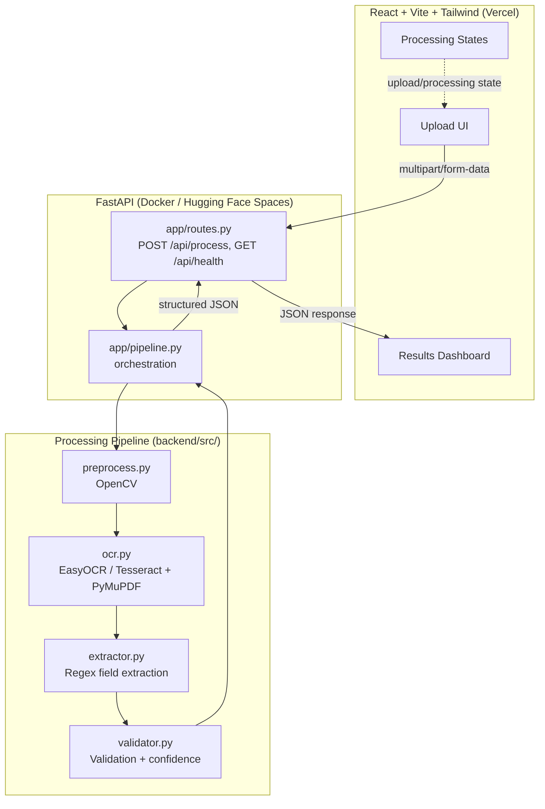
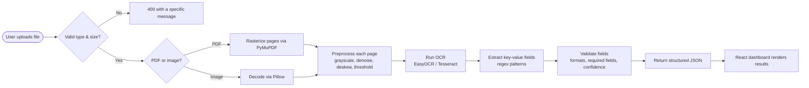

# AI Smart Document Processing

An AI-powered **Intelligent Document Processing (IDP)** application: upload a
PDF, JPG, or PNG invoice/document, and a FastAPI backend runs OpenCV
preprocessing, OCR (EasyOCR/Tesseract), regex-based field extraction, and
validation — returning structured, confidence-scored JSON to a React
dashboard.

This is an original, from-scratch portfolio project demonstrating practical
IDP engineering: OCR, image preprocessing, information extraction, data
validation, a REST API, and a production-style deployment. It does not
contain any proprietary code, data, or branding from any employer.

## Demo

**Live Demo:** _[DEPLOYED_URL — add after deploying, see [Deployment](#deployment)]_

**Repository:** [github.com/arun-abishek-n/AI-Document-Processor](https://github.com/arun-abishek-n/AI-Document-Processor)

## Table of Contents

- [Overview](#ai-smart-document-processing)
- [Demo](#demo)
- [Features](#features)
- [Architecture](#architecture)
- [How It Works](#how-it-works)
- [Tech Stack](#tech-stack)
- [Project Structure](#project-structure)
- [Installation](#installation)
- [Environment Variables](#environment-variables)
- [API](#api)
- [Testing](#testing)
- [Deployment](#deployment)
- [Screenshots](#screenshots)
- [Future Improvements](#future-improvements)
- [Author](#author)
- [License](#license)

## Features

- 📤 Upload PDF, JPG, or PNG documents via drag-and-drop or file browser, with client-side type/size validation
- 🖼️ Multi-page PDF support (rasterized page-by-page)
- 🧹 Image preprocessing: grayscale, denoising, adaptive thresholding, deskewing, auto-resize
- 🔍 OCR via **EasyOCR** (default, no external binary) or **Tesseract**
- 🧾 Invoice-style key-value field extraction (invoice number, dates, totals, tax, vendor, customer, email, phone)
- ✅ Field-level validation (date formats, numeric amounts, email format) plus a document-level pass/fail summary
- 📊 Per-field and overall **confidence scores**
- ⬇️ **JSON** and **CSV** export directly from the browser
- ⚠️ Meaningful error messages for unsupported files, oversized uploads, corrupted documents, and backend/network failures — no silent failures or generic crashes
- 🎛️ Modern React + Tailwind dashboard with honest processing states (real upload progress, then an elapsed-time indicator while the server runs OCR — no fabricated progress percentages)

## Architecture



## How It Works



1. **Upload** — the browser posts the file to `POST /api/process` with real upload-progress tracking.
2. **Validate** — the backend rejects unsupported extensions, oversized files, and empty/corrupted uploads with a specific error message (never a generic 500 or silent failure).
3. **Rasterize / decode** — PDFs are rendered page-by-page via PyMuPDF; images are decoded via Pillow.
4. **Preprocess** — each page is grayscaled, denoised, deskewed, and adaptively thresholded with OpenCV to improve OCR accuracy on imperfect scans/photos.
5. **OCR** — EasyOCR (default) or Tesseract extracts raw text and per-word confidence scores.
6. **Extract** — regex patterns pull out key-value fields (invoice number, dates, amounts, contact info) from the OCR text.
7. **Validate** — each field is checked for format correctness (dates parse, amounts are numeric, emails look like emails) and required fields are confirmed present; a document-level confidence and pass/fail status is computed.
8. **Respond** — the API returns one structured JSON payload; the dashboard renders it as overview cards, a fields table, extracted text, and a JSON viewer, with JSON/CSV export generated client-side from that same payload.

## Tech Stack

| Category          | Technology                                                                 |
| ------------------ | --------------------------------------------------------------------------- |
| Frontend           | [React](https://react.dev/), [TypeScript](https://www.typescriptlang.org/), [Vite](https://vite.dev/), [Tailwind CSS](https://tailwindcss.com/) |
| Backend            | [FastAPI](https://fastapi.tiangolo.com/), Python 3.11+                     |
| OCR                | [EasyOCR](https://github.com/JaidedAI/EasyOCR) (default), [pytesseract](https://github.com/madmaz/pytesseract) (alternative) |
| Image processing   | [OpenCV](https://opencv.org/), [Pillow](https://python-pillow.org/)         |
| PDF rasterization  | [PyMuPDF](https://pymupdf.readthedocs.io/)                                  |
| Field extraction   | Python `re` (regex)                                                         |
| Data handling      | [Pandas](https://pandas.pydata.org/), [NumPy](https://numpy.org/)           |
| Testing            | [pytest](https://pytest.org/), FastAPI `TestClient`                         |
| Deployment         | [Vercel](https://vercel.com/) (frontend), [Hugging Face Spaces](https://huggingface.co/spaces) / Docker (backend) |

## Project Structure

```
AI-Document-Processor/
│
├── frontend/                 # React + Vite + TypeScript + Tailwind UI
│   ├── src/
│   │   ├── components/       # Header, Hero, UploadCard, ResultsDashboard, ...
│   │   ├── lib/               # api.ts (backend client), export.ts (JSON/CSV)
│   │   └── App.tsx
│   ├── package.json
│   └── .env.example
│
├── backend/
│   ├── app/                  # FastAPI: main.py, routes.py, schemas.py, pipeline.py
│   ├── src/                  # Original processing pipeline (unchanged logic)
│   │   ├── preprocess.py     # OpenCV preprocessing
│   │   ├── ocr.py             # EasyOCR / Tesseract + PDF rasterization
│   │   ├── extractor.py       # Regex-based field extraction
│   │   ├── validator.py       # Field validation & confidence scoring
│   │   ├── exporter.py        # JSON/CSV payload builder
│   │   └── utils.py           # Logging, upload validation
│   ├── tests/                # pytest suite
│   ├── config.py
│   ├── requirements.txt
│   ├── requirements-dev.txt
│   └── Dockerfile
│
├── .gitignore
├── README.md
└── LICENSE
```

## Installation

### Backend

```bash
cd backend
python -m venv venv
venv\Scripts\activate        # Windows
source venv/bin/activate      # macOS / Linux

pip install -r requirements.txt
cp .env.example .env          # optional — defaults work out of the box
uvicorn app.main:app --reload
```

The API is now at `http://localhost:8000` (interactive docs at `/docs`).

> **Using Tesseract instead of EasyOCR?** Install the Tesseract binary
> separately ([installation guide](https://github.com/tesseract-ocr/tesseract#installing-tesseract)),
> then set `OCR_ENGINE=tesseract` (env var or in `config.py`), and set
> `TESSERACT_CMD` if it isn't already on your PATH.

### Frontend

```bash
cd frontend
npm install
cp .env.example .env    # VITE_API_URL=http://localhost:8000
npm run dev
```

Open `http://localhost:5173`, upload a PDF/JPG/PNG, and watch it process end-to-end.

## Environment Variables

**Backend** (`backend/.env`, see `backend/.env.example`):

| Variable          | Default                   | Purpose                                                        |
| ------------------ | -------------------------- | ---------------------------------------------------------------- |
| `ALLOWED_ORIGINS`  | `http://localhost:5173`   | Comma-separated frontend origins allowed by CORS                |
| `OCR_ENGINE`       | `easyocr`                 | `easyocr` or `tesseract`                                        |
| `TESSERACT_CMD`    | _(unset)_                 | Path to the Tesseract binary, if not on PATH                     |
| `LOG_LEVEL`        | `INFO`                    | Python logging level                                             |

**Frontend** (`frontend/.env`, see `frontend/.env.example`):

| Variable        | Default                   | Purpose                                   |
| ---------------- | -------------------------- | -------------------------------------------- |
| `VITE_API_URL`   | `http://localhost:8000`   | Base URL of the deployed backend API      |

No API keys are required anywhere in this project — OCR runs locally via EasyOCR/Tesseract, not a paid third-party API.

## API

### `GET /api/health`

Lightweight liveness + config check (does **not** load the OCR model, so it stays fast even on a cold instance).

```json
{ "status": "ok", "ocr_engine": "easyocr", "allowed_extensions": [".pdf", ".jpg", ".jpeg", ".png"], "max_file_size_mb": 20 }
```

### `POST /api/process`

`multipart/form-data` with a `file` field (PDF/JPG/PNG, ≤ 20 MB by default). Optional `?ocr_engine=tesseract` query param to override the server default for one request.

```json
{
  "source_file": "invoice.png",
  "file_type": "png",
  "page_count": 1,
  "processing_time_seconds": 4.21,
  "ocr_engine": "easyocr",
  "is_valid_document": true,
  "overall_confidence": 0.7809,
  "missing_required_fields": [],
  "invalid_fields": [],
  "low_confidence_fields": [],
  "fields": {
    "invoice_number": { "value": "INV-2024-0587", "confidence": 0.7809, "is_present": true, "is_valid": true, "issue": null }
  },
  "raw_text": "INVOICE\nInvoice Number: INV-2024-0587\n..."
}
```

A rejected upload (unsupported type, oversized, empty, or corrupted) returns HTTP 400 with a `{"detail": "..."}` message describing exactly what was wrong — never a bare 500 or silent failure. Full interactive docs at `/docs`.

## Testing

```bash
cd backend
pip install -r requirements-dev.txt
pytest                 # 17 fast tests: extraction, validation, API error handling — no OCR model download
pytest -m integration  # + 1 real end-to-end OCR test (downloads/loads the EasyOCR model)
```

Manually verified scenarios (backend + frontend, in a real browser):

| # | Scenario                          | Result                                                        |
| - | ---------------------------------- | ---------------------------------------------------------------- |
| 1 | Upload a valid PNG/PDF invoice     | Processes successfully; fields, text, and JSON render correctly |
| 2 | Upload an unsupported file (.txt)  | Rejected client-side before any network request, with a clear message |
| 3 | Upload an empty or corrupted file  | Backend returns 400 with a specific "could not read this file" message |
| 4 | Oversized file                     | Rejected with the exact size limit in the error message          |
| 5 | Backend unreachable                | Frontend shows an "API unreachable" badge and disables the upload with an explanation, instead of hanging |

## Deployment

Architecture: **React frontend on Vercel** talking over HTTPS to a **FastAPI backend in a Docker container on Hugging Face Spaces**.

EasyOCR pulls in PyTorch and needs meaningfully more memory than most free web-service tiers provide (Render/Railway/Fly's free tiers cap around 256–512 MB, which risks an out-of-memory crash — a different flavor of the original bug). Hugging Face Spaces' free Docker tier provides 16 GB RAM, which comfortably fits this pipeline at zero cost, so that's what this project targets. Vercel is used for the frontend because it's free, fast, and purpose-built for static/SPA React builds — deploying a heavy OCR backend there wouldn't make sense (their serverless functions aren't suited to PyTorch's size or to long-running CPU-bound OCR).

### Backend → Hugging Face Spaces

1. Create a new [Space](https://huggingface.co/new-space) with the **Docker** SDK.
2. Clone the Space's own git repo it gives you, then copy this repo's `backend/` contents into it (everything except `venv/`, `outputs/`, `models/`, `logs/` — see `backend/.dockerignore`):
   ```bash
   git clone https://huggingface.co/spaces/<your-username>/<space-name>
   cp -r backend/* backend/.dockerignore backend/.gitignore <space-name>/
   cd <space-name>
   git add . && git commit -m "Deploy backend" && git push
   ```
3. In the Space's **Settings → Variables and secrets**, add `ALLOWED_ORIGINS` set to your Vercel frontend's URL (e.g. `https://ai-smart-document-processing.vercel.app`).
4. The Space builds the Dockerfile (which pre-downloads the EasyOCR model at build time) and starts serving on port `7860`. Your API is then at `https://<your-username>-<space-name>.hf.space`.
5. Confirm it's live: `curl https://<your-username>-<space-name>.hf.space/api/health`.

### Frontend → Vercel

1. Import this GitHub repo into [Vercel](https://vercel.com/new), setting **Root Directory** to `frontend`.
2. Framework preset: Vite (auto-detected). Build command `npm run build`, output directory `dist` (both auto-detected).
3. Add an environment variable `VITE_API_URL` set to your Hugging Face Space's URL from above.
4. Deploy. Vercel gives you a `https://<project>.vercel.app` URL — that's the link to put in [Demo](#demo) above.

### Verifying production end-to-end

- `GET <backend-url>/api/health` returns `200` with `"status": "ok"`.
- The deployed frontend shows a green "API online" badge (confirms CORS is configured correctly).
- Uploading a real invoice through the deployed frontend returns real results — not a CORS error, not a timeout.

## Screenshots

_[Add screenshots of the landing page, upload flow, and results dashboard here after deploying.]_

## Future Improvements

- Replace regex-based extraction with a fine-tuned NER/transformer model for higher accuracy on unstructured layouts
- Add table/line-item detection (quantities, unit prices) — not implemented in the current extractor, so the dashboard intentionally doesn't show a tables section
- Support batch processing of multiple documents in one session
- Add a human-in-the-loop correction UI that feeds back into validation rules
- Persist processed documents and results to a lightweight database for history/search
- Add multi-language OCR support beyond English
- Stream true per-stage progress (e.g. via Server-Sent Events) instead of a single upload+processing lifecycle

## Author

**Arun Abishek**
GitHub: [@arun-abishek-n](https://github.com/arun-abishek-n)

## License

This project is licensed under the [MIT License](LICENSE).
